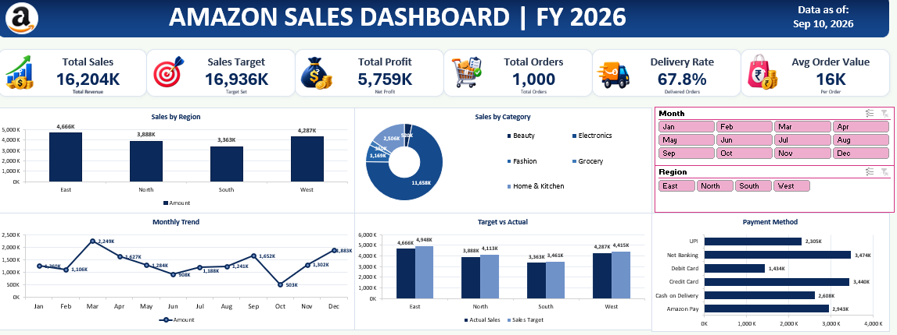
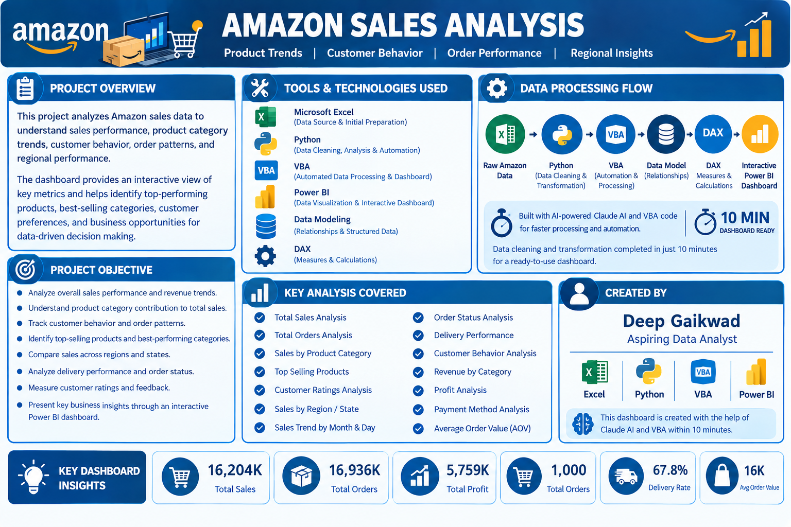

# 🛒 Amazon Sales Analysis Dashboard | Excel VBA & AI Automation

## 📌 Project Overview

The **Amazon Sales Analysis Dashboard** is an interactive and automated Excel dashboard developed using **Microsoft Excel, VBA, and AI-assisted development**.

The project transforms Amazon sales data into a professional business dashboard that provides a clear view of **sales performance, profitability, orders, delivery performance, regional performance, monthly trends, and target achievement**.

The dashboard was developed with the support of **Claude AI** using a structured Master Prompt to generate and implement the VBA automation.

---

## 🎯 Project Objectives

- Analyze Amazon sales performance using Excel.
- Monitor sales, profit, orders, and delivery performance.
- Compare actual sales against sales targets.
- Analyze regional sales performance.
- Track monthly sales trends.
- Provide an interactive and user-friendly dashboard.
- Automate dashboard creation and formatting using VBA.
- Demonstrate the practical use of Generative AI in Excel automation.

---

## 💼 Business Problem

Large sales datasets can make it difficult to quickly understand business performance.

This project provides a centralized dashboard to help users:

- Monitor overall sales performance.
- Identify strong and weak regions.
- Analyze monthly sales trends.
- Compare actual sales with targets.
- Track profitability and order volume.
- Evaluate delivery performance.
- Make data-driven business decisions.

---

## 🛠️ Tools & Technologies

- **Microsoft Excel**
- **Excel VBA**
- **Powerful Excel Dashboard Techniques**
- **Data Analysis**
- **Data Visualization**
- **Generative AI**
- **Claude AI**

---
## 🖼️ Dashboard Preview

### Amazon Sales Dashboard

### Amazon Sales Analysis

---

## 🤖 AI-Assisted VBA Development

A major feature of this project is the use of **Generative AI to accelerate VBA development**.

A structured **Master Prompt** was created to provide Claude AI with the project requirements and dashboard specifications.

Claude AI was then used to assist with the generation of VBA code required for the dashboard automation.

This demonstrates a practical workflow combining:

**Business Requirements → Master Prompt → AI-Assisted VBA → Automated Dashboard → Business Insights**

---

## ⚡ Rapid Dashboard Development

The dashboard was created in approximately **10 minutes** with the assistance of Claude AI and a structured VBA Master Prompt.

The project demonstrates how Generative AI can significantly accelerate repetitive Excel development tasks while still requiring proper business requirements, data understanding, testing, and validation.

---

## 📊 Key Performance Indicators

| KPI | Value |
|---|---:|
| **Total Sales** | 16,204K |
| **Sales Target** | 16,936K |
| **Total Profit** | 5,759K |
| **Total Orders** | 1,000 |
| **Delivery Rate** | 67.8% |
| **Average Order Value** | 16K |

---

## 📈 Dashboard Analysis

### Sales Performance

The dashboard provides an overview of total sales and compares sales performance against the defined target.

### Profitability

Total profit is monitored to understand the financial performance generated from sales.

### Order Analysis

The dashboard tracks total orders and provides an overview of order volume.

### Delivery Performance

Delivery Rate is included as a key operational KPI to monitor order fulfillment performance.

### Average Order Value

Average Order Value provides an indication of the average sales value generated per order.

---

## 🌍 Regional Analysis

The dashboard provides sales analysis across the following regions:

- East
- North
- South
- West

Regional analysis helps identify differences in sales performance across geographical markets.

---

## 📅 Monthly Sales Trend

The dashboard provides a month-wise view of sales performance across the year:

- January
- February
- March
- April
- May
- June
- July
- August
- September
- October
- November
- December

This allows users to identify sales trends and changes throughout the year.

---

## 🎯 Target vs Actual Analysis

The dashboard compares:

- **Actual Sales**
- **Sales Target**

This provides a clear view of overall target achievement and helps identify performance gaps.

---

## 💳 Payment Method Analysis

The project includes analysis of different payment methods, including:

- UPI
- Net Banking
- Debit Card
- Credit Card
- Cash on Delivery
- Amazon Pay

---

## 🖥️ Interactive Dashboard Features

- Interactive sales dashboard
- KPI cards
- Regional analysis
- Monthly sales analysis
- Target vs Actual analysis
- Payment method analysis
- Interactive filtering
- Automated dashboard creation
- Automated formatting using VBA
- Business-focused data visualization

---

## 📂 Project Structure

Amazon Project/
│
├── Icons/
│
├── Images/
│   ├── Amazon_Dashboard.png
│   └── Amazon_Sales_Analysis.png
│
├── Amazon Project.xlsm
├── Dataset-Amazon.xlsx
├── MASTER PROMPT VBA.docx
├── README.md
├── Steps of VBA, Dashboard.txt
└── VBA CODE.txt

---
📁 Project Files

File / Folder				Description
Amazon Project.xlsm			Main Excel workbook containing the dashboard and VBA automation
Dataset-Amazon.xlsx			Amazon sales dataset used for analysis
MASTER PROMPT VBA.docx			Master Prompt used with Claude AI for VBA code generation
VBA CODE.txt				VBA code used for dashboard automation
Steps of VBA, Dashboard.txt		Documentation of the VBA and dashboard development process
Images/					Dashboard and project analysis images
Icons/					Visual assets used in the project
README.md				Project documentation

---

##  📚 Learning Outcomes

This project demonstrates practical knowledge of:

Excel Dashboard Development
Excel VBA
VBA Automation
Data Analysis
Data Visualization
KPI Development
Business Reporting
Sales Analysis
Regional Analysis
Category Analysis
Trend Analysis
Prompt Engineering
AI-Assisted Development
Generative AI for Automation

--- 

## 🧠 Skills Demonstrated

Excel & Analytics
Advanced Excel
Dashboard Development
Data Analysis
Data Visualization
KPI Analysis
Business Reporting

VBA
VBA Programming
Dashboard Automation
Excel Automation
Automated Formatting
Automated Chart Creation
Dashboard Development

Generative AI
Claude AI
Prompt Engineering
Master Prompt Creation
AI-Assisted Coding
AI-Assisted VBA Development
Generative AI for Excel Automation

--- 

## ⚙️ VBA Automation

Excel VBA is used to automate dashboard development and repetitive Excel tasks.

The project demonstrates how VBA can be combined with Generative AI to speed up:

Dashboard creation
Chart creation
Formatting
Layout creation
Data analysis presentation
Dashboard automation

The complete VBA code is provided in the project repository for reference.

--- 

## ⭐ Project Highlight

An AI-assisted Amazon Sales Analysis Dashboard developed using Microsoft Excel and VBA with the help of Claude AI and a structured Master Prompt. The dashboard demonstrates how Generative AI can accelerate Excel VBA automation and the development of interactive business dashboards.

--- 

👨‍💻 Created By

Deep Gaikwad

Aspiring Data Analyst

Skills: Excel | SQL | Python | Power BI | Data Analysis | VBA
